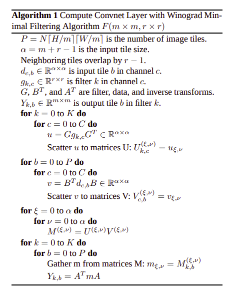
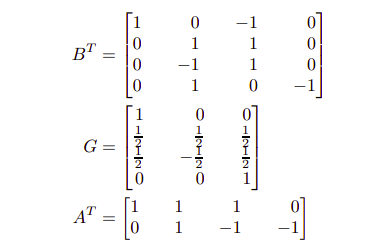

## Winograd based convolution
#### Input pre-processing:
* Input is of the form `Batch_size * input_channels * H * W`
* **Pad the input:** Each Input layer is padded by the required number parallely using cuda kernel **pad_input**
* **Pad more for proper tiling:** Add an extra layer of padding to make height and width of the image even if not. This is required to make proper tiles  from the image.

#### Convolution Operation:
* Each filter is of the form `output_channels *input_channels* k_H * k_W` 
* **Winograd Algorithm** 

* In our case m=2(fixed), r = 3(kernel size - fixed), and the corresponding matrices are:

#### Implementation Details:
* We precomputed **U = GdGT** in parallel for output_channels *input_channels number of filters of size 3*3 using the **precompute** kernel.
* We compute Y(defined above) using two kernels, **tile** and **lastcal**. **lastcal** applies the operation **AT** and **A** (as defined above) in parallel. The **tile** kernel mainly takes care of the rest of the internal algorithm. 
* Some salient features of **tile** kernel are:
  * We divide the work such that each block in the tile kernel runs with maximum efficiency by calling the MAX_THREADS number of threads in them.
  * For summing across channels, we use the logn time parallel sum.
* Due to memory constraints, we loop over batch_size, but we have provision in our code to process multiple batches in parallel given enough memory.

#### Output Post-Processing:
* Finally we call **cutpad** to remove the extra pads that were added during tiling in parallel.

## Shortcomings
* In the current implementation, there is loop on the `batch_size`, alleviating this again requires more memory. This makes the implementation slower.
* We have fixed the filter size = 3 and stride = 1.
* Even when we removed the matrix multiplication and replaced it with simplified final version calculation, thus reducing the number of multiplications from 144 to 16 per tile, the speed gain wasn't much. This was due to the fact that we are processing each tile in parallel. Thus the advantage of reducing these many operations wasn't reflected. Given if we were processing each tile sequentially(as in case of cpu implementation), we would have gained tremendous speedup. Apart from this, to implement Winograd we are using 4 times extra memory and a number of extra operations(these having advantage in serial implementation but overshadowed in the parallel implementation) 

## References
* http://arxiv.org/abs/1509.09308
* https://blog.usejournal.com/understanding-winograd-fast-convolution-a75458744ff
